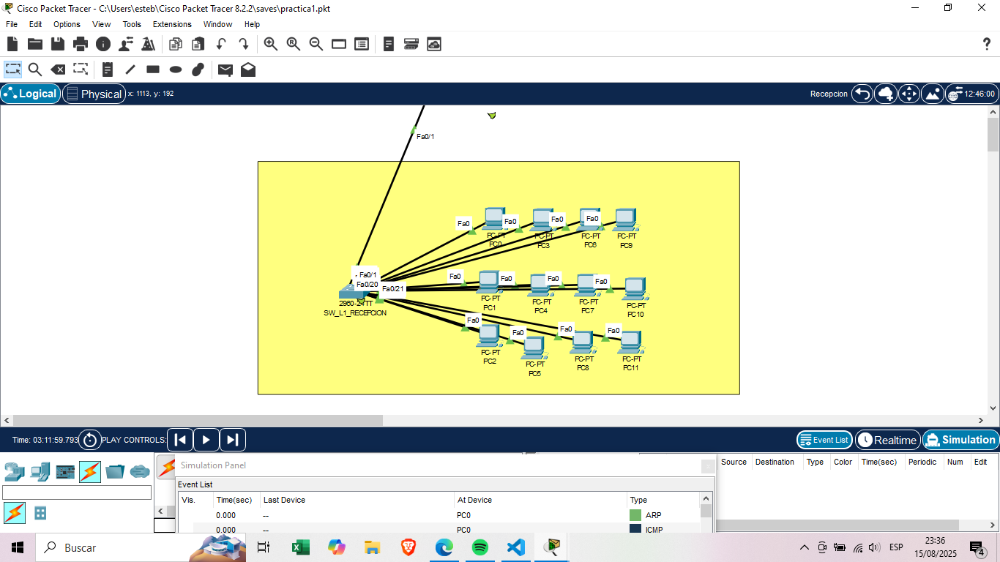

# Practica 1
Nombre: Juan Esteban Chacón Trampe
Carnet: 202300431

## 1. Tabla de Direccionamiento IP

### Piso 1 LW_1

|Numero|  DePartamento          | Dispositivo | Dirección IP   | Máscara          |
|------|---------------------|-------------|----------------|------------------|
|1| Recepción           | PC-PT-PC0         | 192.168.31.10  | 255.255.255.0    |
|2| Recepción           | PC-PT-PC1         | 192.168.31.11  | 255.255.255.0    |
|3| Recepción           | PC-PT-PC2         | 192.168.31.12  | 255.255.255.0    |
|4| Recepción           | PC-PT-PC3         | 192.168.31.13  | 255.255.255.0    |
|5| Recepción           | PC-PT-PC4         | 192.168.31.14  | 255.255.255.0    |
|6| Recepción           | PC-PT-PC5         | 192.168.31.15  | 255.255.255.0    |
|7| Recepción           | PC-PT-PC6         | 192.168.31.16  | 255.255.255.0    |
|8| Recepción           | PC-PT-PC7         | 192.168.31.17  | 255.255.255.0    |
|9| Recepción           | PC-PT-PC8         | 192.168.31.18  | 255.255.255.0    |
|10| Recepción           | PC-PT-PC9         | 192.168.31.19  | 255.255.255.0    |
|11| Recepción           | PC-PT-PC10         | 192.168.31.20  | 255.255.255.0    |
|12| Recepción           | PC-PT-PC11         | 192.168.31.21  | 255.255.255.0    |

|Numero|  DePartamento          | Dispositivo | Dirección IP   | Máscara          |
|------|---------------------|-------------|----------------|------------------|
|1| Contabilidad           | PC-PT-PC12         | 192.168.31.30  | 255.255.255.0    |
|2| Contabilidad           | PC-PT-PC13         | 192.168.31.31  | 255.255.255.0    |
|3| Contabilidad           | PC-PT-PC14         | 192.168.31.32  | 255.255.255.0    |
|4| Contabilidad           | PC-PT-PC15         | 192.168.31.33  | 255.255.255.0    |
|5| Contabilidad           | PC-PT-PC16         | 192.168.31.34  | 255.255.255.0    |
|6| Contabilidad           | PC-PT-PC17         | 192.168.31.35  | 255.255.255.0    |
|7| Contabilidad           | PC-PT-PC18         | 192.168.31.36  | 255.255.255.0    |
|8| Contabilidad           | PC-PT-PC19         | 192.168.31.37  | 255.255.255.0    |

|Numero|  DePartamento          | Dispositivo | Dirección IP   | Máscara          |
|------|---------------------|-------------|----------------|------------------|
|1| Legal           | PC-PT-PC20         | 192.168.31.40  | 255.255.255.0    |
|2| Legal           | PC-PT-PC21         | 192.168.31.41  | 255.255.255.0    |
|3| Legal           | PC-PT-PC22         | 192.168.31.42  | 255.255.255.0    |
|4| Legal           | PC-PT-PC23         | 192.168.31.43  | 255.255.255.0    |
|5| Legal           | PC-PT-PC24         | 192.168.31.44  | 255.255.255.0    |

|Numero|  DePartamento          | Dispositivo | Dirección IP   | Máscara          |
|------|---------------------|-------------|----------------|------------------|
|1| Reuniones           | PC-PT-PC25         | 192.168.31.50  | 255.255.255.0    |
|2| Reuniones           | PC-PT-PC26         | 192.168.31.51  | 255.255.255.0    |
|3| Reuniones           | PC-PT-PC27         | 192.168.31.52  | 255.255.255.0    |
|4| Reuniones           | PC-PT-PC28         | 192.168.31.53  | 255.255.255.0    |
|5| Reuniones           | PC-PT-PC29         | 192.168.31.54  | 255.255.255.0    |

### Piso 2 LW_2

|Numero|  DePartamento          | Dispositivo | Dirección IP   | Máscara          |
|------|---------------------|-------------|----------------|------------------|
|1| Arquitectura           | Laptop-PT-Laptop0          | 192.168.31.60  | 255.255.255.0    |
|2| Arquitectura           | Laptop-PT-Laptop1          | 192.168.31.61  | 255.255.255.0    |
|3| Arquitectura           | Laptop-PT-Laptop2          | 192.168.31.62  | 255.255.255.0    |
|4| Arquitectura           | Laptop-PT-Laptop3          | 192.168.31.63  | 255.255.255.0    |
|5| Arquitectura           | Laptop-PT-Laptop4          | 192.168.31.64  | 255.255.255.0    |
|6| Arquitectura           | Laptop-PT-Laptop5          | 192.168.31.65  | 255.255.255.0    |

|Numero|  DePartamento          | Dispositivo | Dirección IP   | Máscara          |
|------|---------------------|-------------|----------------|------------------|
|1| Urbanismo           | Laptop-PT-Laptop6          | 192.168.31.70  | 255.255.255.0    |
|2| Urbanismo           | Laptop-PT-Laptop7          | 192.168.31.71  | 255.255.255.0    |
|3| Urbanismo           | Laptop-PT-Laptop8          | 192.168.31.72  | 255.255.255.0    |
|4| Urbanismo           | Laptop-PT-Laptop9          | 192.168.31.73  | 255.255.255.0    |
|5| Urbanismo           | Laptop-PT-Laptop10         | 192.168.31.74  | 255.255.255.0    |
|6| Urbanismo           | Laptop-PT-Laptop11         | 192.168.31.75  | 255.255.255.0    |

|Numero|  DePartamento          | Dispositivo | Dirección IP   | Máscara          |
|------|---------------------|-------------|----------------|------------------|
|1| Reuniones           | Laptop-PT-Laptop12          | 192.168.31.80  | 255.255.255.0    |
|2| Reuniones           | Laptop-PT-Laptop13          | 192.168.31.81  | 255.255.255.0    |
|3| Reuniones           | Laptop-PT-Laptop14          | 192.168.31.82  | 255.255.255.0    |
|4| Reuniones           | Laptop-PT-Laptop15          | 192.168.31.83  | 255.255.255.0    |
|5| Reuniones           | Laptop-PT-Laptop16          | 192.168.31.84  | 255.255.255.0    |

### Piso 3 LW_3

|Numero|  DePartamento          | Dispositivo | Dirección IP   | Máscara          |
|------|---------------------|-------------|----------------|------------------|
|1| Direccion           | PC-PT-PC30         | 192.168.31.90  | 255.255.255.0    |
|2| Direccion           | PC-PT-PC31         | 192.168.31.91  | 255.255.255.0    |
|3| Direccion           | PC-PT-PC32         | 192.168.31.92  | 255.255.255.0    |
|4| Direccion           | PC-PT-PC33         | 192.168.31.93  | 255.255.255.0    |

|Numero|  DePartamento          | Dispositivo | Dirección IP   | Máscara          |
|------|---------------------|-------------|----------------|------------------|
|1| Ingenieria           | PC-PT-PC34         | 192.168.31.100  | 255.255.255.0    |
|2| Ingenieria           | PC-PT-PC35         | 192.168.31.101  | 255.255.255.0    |
|3| Ingenieria           | PC-PT-PC36         | 192.168.31.102  | 255.255.255.0    |
|4| Ingenieria           | PC-PT-PC37         | 192.168.31.104  | 255.255.255.0    |
|5| Ingenieria           | PC-PT-PC38         | 192.168.31.105  | 255.255.255.0    |
|6| Ingenieria           | PC-PT-PC39         | 192.168.31.106  | 255.255.255.0    |

|Numero|  DePartamento          | Dispositivo | Dirección IP   | Máscara          |
|------|---------------------|-------------|----------------|------------------|
|1| Servidores           | Server-PT-Server0         | 192.168.31.200  | 255.255.255.0    |
|2| Servidores           | Server-PT-Server1         | 192.168.31.201  | 255.255.255.0    |
|3| Servidores           | Server-PT-Server2         | 192.168.31.202  | 255.255.255.0    |

## Comandos utilizadosd

        enable
        configure terminal
        hostname SW_L1
        enable secret 202300431 
        line console 0
        password 202300431 
        login
        service password-encryption
        end
        copy running-config startup-config

en SW_L1 va el nombre del host

## Imagenes de Vpcs

1. Departamento de Recepción 

2. Departamento de Contabilidad 

3. Departamento Legal 

4. Sala de Reuniones 

5. Departamento de Arquitectura 

6. Departamento de Urbanismo
 
7. Sala de revisión de planos 

8. Departamento de Dirección General 

9. Departamento de Ingeniería Civil 

10. Departamento de Servidores Principales 

## Imagenes 
0. Edificio por Pisos

1. Departamento de Recepción 

2. Departamento de Contabilidad 

3. Departamento Legal 

4. Sala de Reuniones 

5. Departamento de Arquitectura 

6. Departamento de Urbanismo 

7. Sala de revisión de planos 

8. Departamento de Dirección General 

9. Departamento de Ingeniería Civil 

10. Departamento de Servidores Principales

## Demsotracion de ARP Y ICMP

1. ARP

2. ICMP

