<div align="center">
  
 
  # UNIVERSIDAD DE SAN CARLOS DE GUATEMALA
  ## Facultad de Ingeniería
  ### Escuela de Ciencias y Sistemas
  
  ---
  
  # MANUAL TÉCNICO
  ## PROYECTO 1: REDES 2025
  
  **Nombre:** Juan Esteban Chacón Trampe  
  **Carnet:** 202300431  
  **Curso:** Redes 1, Segundo Semestre 2025  
  **Fecha:** 8/09/2025
  
  ---
  
</div>

---

## Introducción

Este manual técnico describe la arquitectura, el funcionamiento y los procedimientos de instalación y uso del Proyecto 1 de Redes. El objetivo es proporcionar una guía clara para desarrolladores y administradores sobre la estructura del sistema, los componentes principales y el flujo de trabajo, facilitando así el mantenimiento, asimismo se tiene la configuracion de cada script utilizado en lo swicths o multiple swhicths como sus puertos, y pruebas de ping entre las computadoras usando su vlan asiganda. Con un presupuesto de todo el trabajo llevado a un campo real.

---

## TOPOLOGIAS:
### TOPOLOGIA
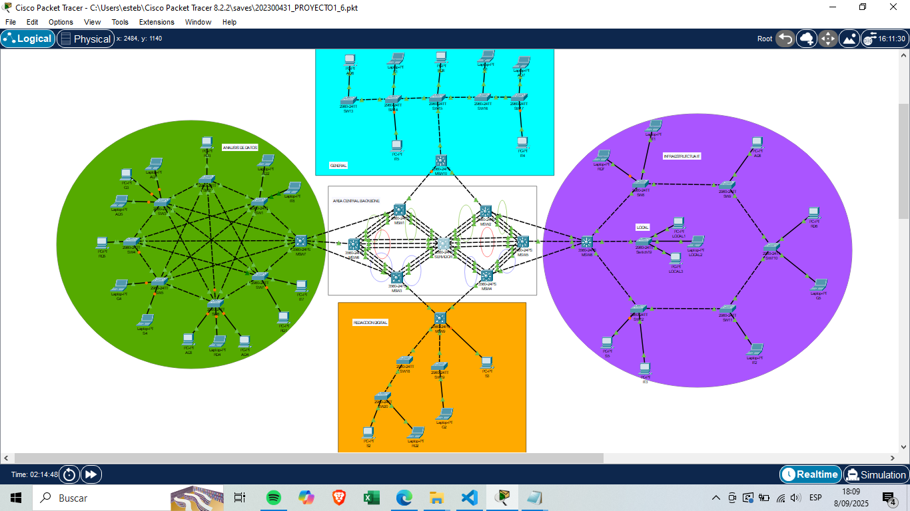

### AREA CENTRAL BACKCONE
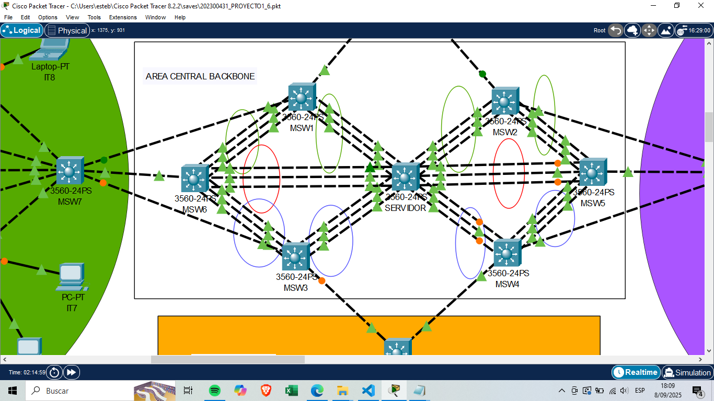
### ANALISS DE DATOS
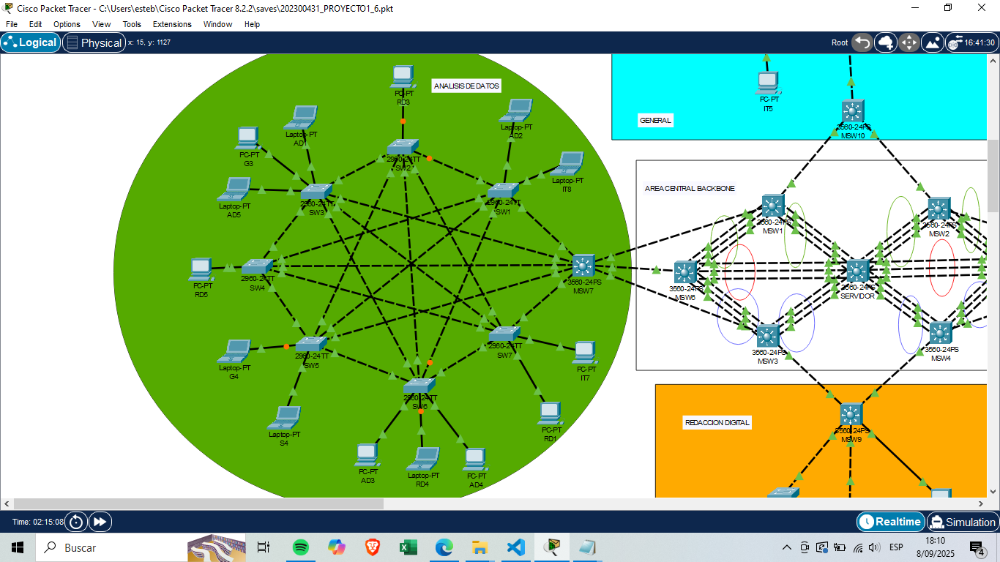
### GERENCIA
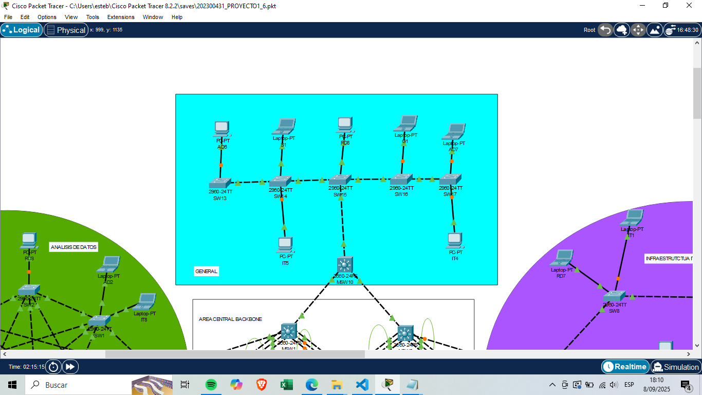
### INFRAESTRUCTURA
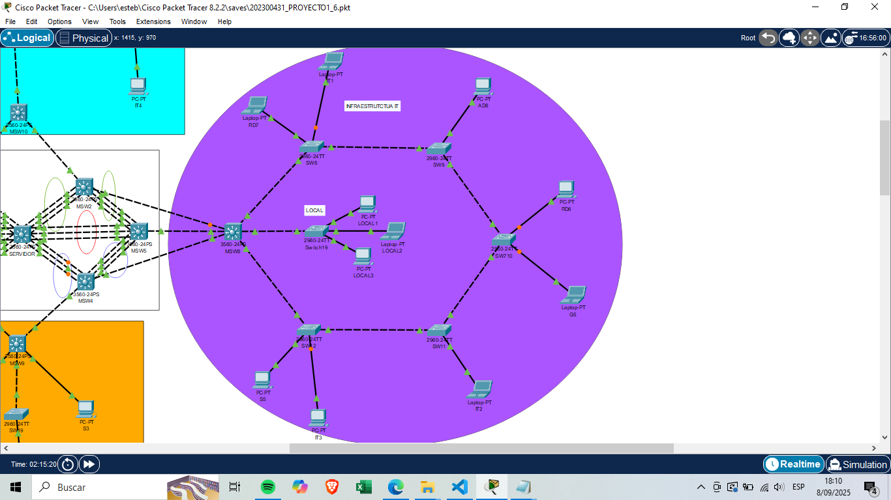
### REDACCION DIGITAL
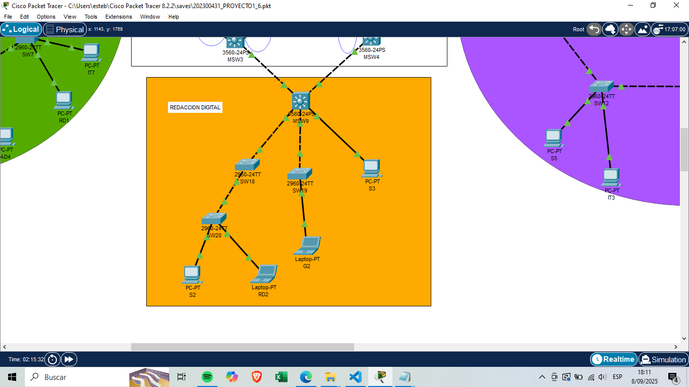


## PINGS DE LAS DISPÓSTIVOS
Se tomo la decision de poner los pins en base su pertenencia siguiendo este orden:
|PINS   | NOMBRE |
|-------|---------|
|192.168.11.1#   | RD#|
|192.168.11.2#   | AD#|
|192.168.11.3#   | IT#|
|192.168.11.4#   | S# |
|192.168.11.5#   | G# |
|192.168.11.7#   | Local# |

### Redaccion Digital:
|Nombre|         Ping |
|------|--------------|
|  RD1  |192.168.11.11|
|  RD2  |192.168.11.12|
|  RD3  |192.168.11.13|
|  RD4  |192.168.11.14|
|  RD5  |192.168.11.15|
|  RD6  |192.168.11.16|
|  RD7  |192.168.11.17|
|  RD8  |192.168.11.18|

### Analisis de Datos:
|Nombre|         Ping |
|------|--------------|
|  AD1  |192.168.11.21|
|  AD2  |192.168.11.22|
|  AD3  |192.168.11.23|
|  AD4  |192.168.11.24|
|  AD5  |192.168.11.25|
|  AD6  |192.168.11.26|
|  AD7  |192.168.11.27|
|  AD8  |192.168.11.28|


### Infraestructuta:
|Nombre|         Ping |
|------|--------------|
|  IT1  |192.168.11.31|
|  IT2  |192.168.11.32|
|  IT3  |192.168.11.33|
|  IT4  |192.168.11.34|
|  IT5  |192.168.11.35|
|  IT7  |192.168.11.37|
|  IT8  |192.168.11.38|

### Segurdiad:
|Nombre|         Ping |
|------|--------------|
|  S1  |192.168.11.41|
|  S2  |192.168.11.42|
|  S3  |192.168.11.43|
|  S4  |192.168.11.44|
|  S5  |192.168.11.45|

### Gerencia:
|Nombre|         Ping |
|------|--------------|
|  G1  |192.168.11.51|
|  G2  |192.168.11.52|
|  G3  |192.168.11.53|
|  G4  |192.168.11.54|
|  G5  |192.168.11.55|

### Local:
|Nombre|         Ping |
|------|--------------|
|  Local1  |192.168.11.71|
|  Local2  |192.168.11.72|
|  Local3  |192.168.11.73|


## BACKCONE AREA CENTRAL
### SERVIDOR
Script: 

```bash
enable 
config terminal
hostname SERVIDOR

vtp version 2
vtp mode server
vtp domain C4_FIUComm

vlan 11
 name RedaccionDigital
exit

vlan 21
 name AnalisisdeDatos
exit

vlan 31
 name Infraestructura
exit

vlan 41
 name Seguridad
exit

vlan 51
 name Gestion
exit

spanning-tree mode rapid-pvst
spanning-tree vlan 11,21,31,41,51 priority 24576

!G1 VERDE PAGP
interface range FastEthernet0/1-3
 switchport trunk encapsulation dot1q
 switchport mode trunk
 channel-group 1 mode desirable
 no shutdown
exit

interface port-channel 1
 switchport trunk encapsulation dot1q
 switchport mode trunk
 switchport trunk allowed vlan 1,11,21,31,41,51
exit

!G2 AZUL LAGP
interface range FastEthernet0/4-6
 switchport trunk encapsulation dot1q
 switchport mode trunk
 channel-group 2 mode active
 no shutdown
exit

interface port-channel 2
 switchport trunk encapsulation dot1q
 switchport mode trunk
 switchport trunk allowed vlan 1,11,21,31,41,51
exit


!G3 VERDE PAGP
interface range FastEthernet0/1-3
 switchport trunk encapsulation dot1q
 switchport mode trunk
 channel-group 3 mode desirable
 no shutdown
exit

interface port-channel 3
 switchport trunk encapsulation dot1q
 switchport mode trunk
 switchport trunk allowed vlan 1,11,21,31,41,51
exit

!G4 AZUL LAGP
interface range FastEthernet0/10-12
 switchport trunk encapsulation dot1q
 switchport mode trunk
 channel-group 4 mode active
 no shutdown
exit

interface port-channel 4
 switchport trunk encapsulation dot1q
 switchport mode trunk
 switchport trunk allowed vlan 1,11,21,31,41,51
exit


!G5 ROJO LAGP
interface range FastEthernet0/13-15
 switchport trunk encapsulation dot1q
 switchport mode trunk
 channel-group 5 mode active
 no shutdown
exit

interface port-channel 5
 switchport trunk encapsulation dot1q
 switchport mode trunk
 switchport trunk allowed vlan 1,11,21,31,41,51
exit

!G6 ROJO LAGP
interface range FastEthernet0/16-18
 switchport trunk encapsulation dot1q
 switchport mode trunk
 channel-group 6 mode active
 no shutdown
exit

interface port-channel 6
 switchport trunk encapsulation dot1q
 switchport mode trunk
 switchport trunk allowed vlan 1,11,21,31,41,51
exit

vtp password proyecto12025
exit 
do write
enable 
reload
```


#### Tabla de SERVIDOR

| Port    | Device   | Status      | Vlan | Duplex | Speed | Type         |
|---------|----------|-------------|------|--------|-------|--------------|
| Fa0/1   | MSW2     | connected   | trunk| auto   | auto  | 10/100BaseTX |
| Fa0/2   | MSW2     | connected   | trunk| auto   | auto  | 10/100BaseTX |
| Fa0/3   | MSW2     | connected   | trunk| auto   | auto  | 10/100BaseTX |
| Fa0/4   | MSW4     | connected   | trunk| auto   | auto  | 10/100BaseTX |
| Fa0/5   | MSW4     | connected   | trunk| auto   | auto  | 10/100BaseTX |
| Fa0/6   | MSW4     | connected   | trunk| auto   | auto  | 10/100BaseTX |
| Fa0/7   | MSW1     | connected   | trunk| auto   | auto  | 10/100BaseTX |
| Fa0/8   | MSW1     | connected   | trunk| auto   | auto  | 10/100BaseTX |
| Fa0/9   | MSW1     | connected   | trunk| auto   | auto  | 10/100BaseTX |
| Fa0/10  | MSW3     | connected   | trunk| auto   | auto  | 10/100BaseTX |
| Fa0/11  | MSW3     | connected   | trunk| auto   | auto  | 10/100BaseTX |
| Fa0/12  | MSW3     | connected   | trunk| auto   | auto  | 10/100BaseTX |
| Fa0/13  | MSW5     | connected   | trunk| auto   | auto  | 10/100BaseTX |
| Fa0/14  | MSW5     | connected   | trunk| auto   | auto  | 10/100BaseTX |
| Fa0/15  | MSW5     | connected   | trunk| auto   | auto  | 10/100BaseTX |
| Fa0/16  | MSW6     | connected   | trunk| auto   | auto  | 10/100BaseTX |
| Fa0/17  | MSW6     | connected   | trunk| auto   | auto  | 10/100BaseTX |
| Fa0/18  | MSW6     | connected   | trunk| auto   | auto  | 10/100BaseTX |
| ....... | ...      | notconnect  | 1    | auto   | auto  | 10/100BaseTX |

### iMAGEN DE GRUPOS Y BIENVENIDA
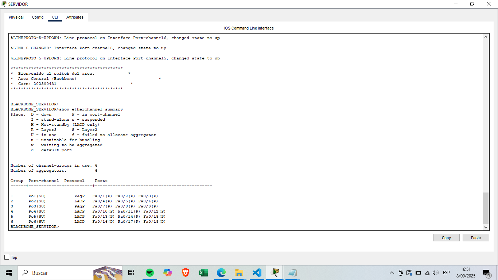
### IMAGEN DE PASSWORD Y VLANS
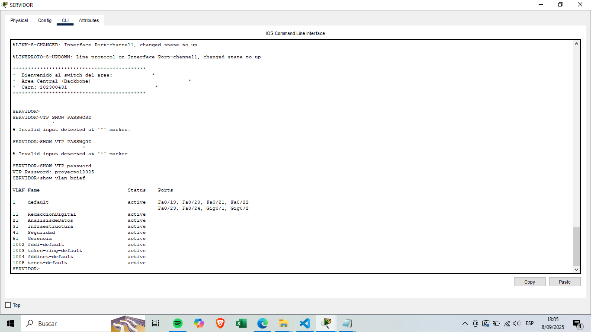

### MSW1

script:
```bash
enable 
config terminal
hostname 1_MSW

vtp version 2
vtp mode client
vtp domain C4_FIUComm

spanning-tree mode rapid-pvst

!G1 VERDE
interface range FastEthernet0/4-6
 switchport trunk encapsulation dot1q
 switchport mode trunk
 channel-group 1 mode desirable
 no shutdown
exit

interface port-channel 1
 switchport trunk encapsulation dot1q
 switchport mode trunk
 switchport trunk allowed vlan 1,11,21,31,41,51
exit

!G2 VERDE
interface range FastEthernet0/7-9
 switchport trunk encapsulation dot1q
 switchport mode trunk
 channel-group 2 mode desirable
 no shutdown
exit

interface port-channel 2
 switchport trunk encapsulation dot1q
 switchport mode trunk
 switchport trunk allowed vlan 1,11,21,31,41,51
exit

vtp password proyecto12025
exit 
write
enable 
reload

```

#### Tabla de MSW1

| Port    | Device   | Status      | Vlan | Duplex | Speed | Type         |
|---------|----------|-------------|------|--------|-------|--------------|
| Fa0/4   | SERVIDOR | connected   | trunk| auto   | auto  | 10/100BaseTX |
| Fa0/5   | SERVIDOR | connected   | trunk| auto   | auto  | 10/100BaseTX |
| Fa0/6   | SERVIDOR | connected   | trunk| auto   | auto  | 10/100BaseTX |
| Fa0/7   | MSW5     | connected   | trunk| auto   | auto  | 10/100BaseTX |
| Fa0/8   | MSW5     | connected   | trunk| auto   | auto  | 10/100BaseTX |
| Fa0/9   | MSW5     | connected   | trunk| auto   | auto  | 10/100BaseTX |
| Fa0/21  | MSW10    | connected   | trunk| auto   | auto  | 10/100BaseTX |
| Fa0/22  | MSW7     | connected   | trunk| auto   | auto  | 10/100BaseTX |
| ...     | ...      | notconnect  | 1    | auto   | auto  | 10/100BaseTX |


#### TABLA DE GRUPOS
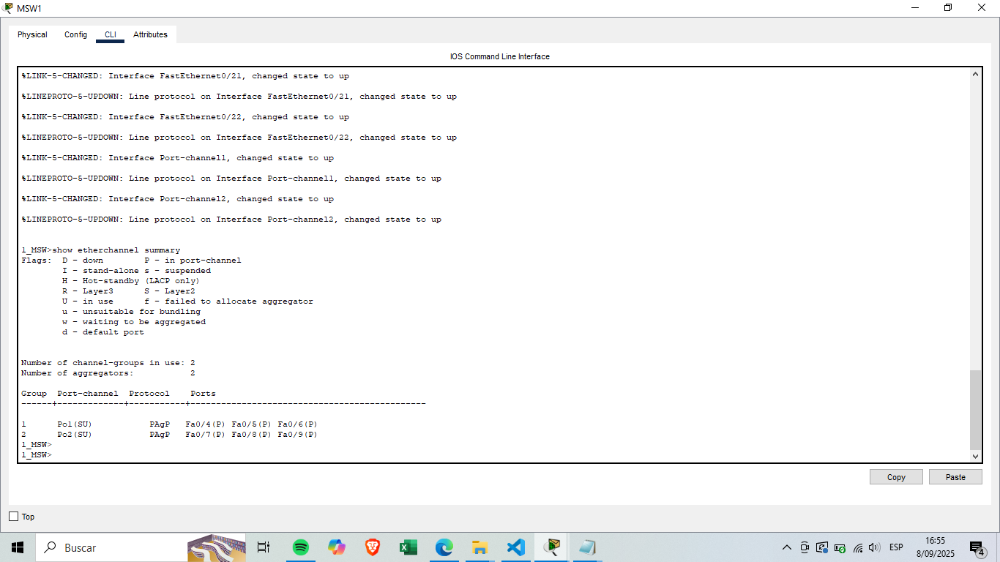

### MSW2

Script:
``` bash
enable 
config terminal
hostname 2_MSW

vtp version 2
vtp mode client
vtp domain C4_FIUComm

spanning-tree mode rapid-pvst

!G1 VERDE
interface range FastEthernet0/1-3
 switchport trunk encapsulation dot1q
 switchport mode trunk
 channel-group 1 mode desirable
 no shutdown
exit

interface port-channel 1
 switchport trunk encapsulation dot1q
 switchport mode trunk
 switchport trunk allowed vlan 1,11,21,31,41,51
exit

!G2 VERDE
interface range FastEthernet0/4-6
 switchport trunk encapsulation dot1q
 switchport mode trunk
 channel-group 2 mode desirable
 no shutdown
exit

interface port-channel 2
 switchport trunk encapsulation dot1q
 switchport mode trunk
 switchport trunk allowed vlan 1,11,21,31,41,51
exit

vtp password proyecto12025
exit 
write
enable 
reload
```

#### Tabla de MSW2


| Port    | Device   | Status      | Vlan | Duplex | Speed | Type         |
|---------|----------|-------------|------|--------|-------|--------------|
| Fa0/1   | SERVIDOR | connected   | trunk| auto   | auto  | 10/100BaseTX |
| Fa0/2   | SERVIDOR | connected   | trunk| auto   | auto  | 10/100BaseTX |
| Fa0/3   | SERVIDOR | connected   | trunk| auto   | auto  | 10/100BaseTX |
| Fa0/4   | MSW5     | connected   | trunk| auto   | auto  | 10/100BaseTX |
| Fa0/5   | MSW5     | connected   | trunk| auto   | auto  | 10/100BaseTX |
| Fa0/6   | MSW5     | connected   | trunk| auto   | auto  | 10/100BaseTX |
| Fa0/21   | MSW9     | connected   | trunk| auto   | auto  | 10/100BaseTX |
| Fa0/22   | MSW10     | connected   | trunk| auto   | auto  | 10/100BaseTX |
| ...     | ...      | notconnect  | 1    | auto   | auto  | 10/100BaseTX |

#### TABLA DE GRUPOS
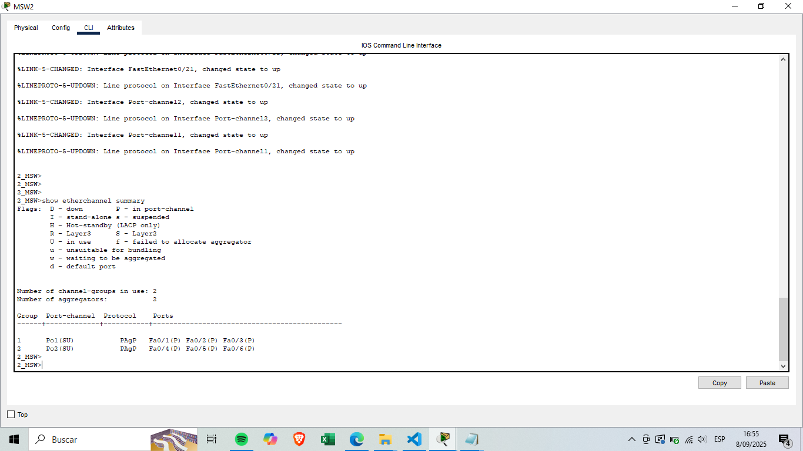

### MSW3 

Script:
```bash
enable 
config terminal
hostname 3_MSW

vtp version 2
vtp mode client
vtp domain C4_FIUComm

spanning-tree mode rapid-pvst

!G1 AZUL
interface range FastEthernet0/1-3
 switchport trunk encapsulation dot1q
 switchport mode trunk
 channel-group 1 mode active
 no shutdown
exit

interface port-channel 1
 switchport trunk encapsulation dot1q
 switchport mode trunk
 switchport trunk allowed vlan 1,11,21,31,41,51
exit

!G2 AZUL
interface range FastEthernet0/10-12
 switchport trunk encapsulation dot1q
 switchport mode trunk
 channel-group 2 mode active
 no shutdown
exit

interface port-channel 2
  switchport trunk encapsulation dot1q
 switchport mode trunk
 switchport trunk allowed vlan 1,11,21,31,41,51
exit

vtp password proyecto12025
exit 
write
enable 
reload
```

#### Tabla de MSW3

Port      Name               Status       Vlan       Duplex  Speed Type

| Port    | Device    | Status      | Vlan | Duplex | Speed | Type         |
|---------|-----------|-------------|------|--------|-------|--------------|
| Fa0/1   | MSW6      | connected   | trunk| auto   | auto  | 10/100BaseTX |
| Fa0/2   | MSW6      | connected   | trunk| auto   | auto  | 10/100BaseTX |
| Fa0/3   | MSW6      | connected   | trunk| auto   | auto  | 10/100BaseTX |
| Fa0/10  | SERVIDOR  | connected   | trunk| auto   | auto  | 10/100BaseTX |
| Fa0/11  | SERVIDOR  | connected   | trunk| auto   | auto  | 10/100BaseTX |
| Fa0/12  | SERVIDOR  | connected   | trunk| auto   | auto  | 10/100BaseTX |
| Fa0/21  | MSW9      | connected   | trunk| auto   | auto  | 10/100BaseTX |
| Fa0/24  | MSW7      | connected   | trunk| auto   | auto  | 10/100BaseTX |
| ...     |           | notconnect  | 1    | auto   | auto  | 10/100BaseTX |

#### TABLA DE GRUPOS

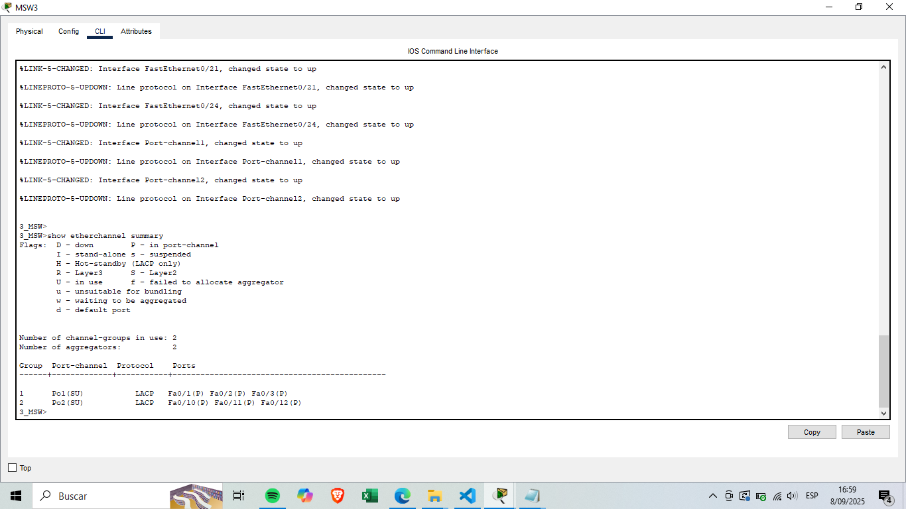

### MSW4

```bash
enable 
config terminal
hostname 4_MSW

vtp version 2
vtp mode client
vtp domain C4_FIUComm

spanning-tree mode rapid-pvst

!G1 AZUL
interface range FastEthernet0/4-6
 switchport trunk encapsulation dot1q
 switchport mode trunk
 channel-group 1 mode active
 no shutdown
exit

interface port-channel 1
 switchport trunk encapsulation dot1q
 switchport mode trunk
 switchport trunk allowed vlan 1,11,21,31,41,51
exit

!G2 AZUL
interface range FastEthernet0/1-3
 switchport trunk encapsulation dot1q
 switchport mode trunk
 channel-group 2 mode active
 no shutdown
exit

interface port-channel 2
 switchport trunk encapsulation dot1q
 switchport mode trunk
 switchport trunk allowed vlan 1,11,21,31,41,51
exit

vtp password proyecto12025
exit 
write
enable 
reload
```
#### Tabla de MSW4


| Port    | Device   | Status      | Vlan | Duplex | Speed | Type         |
|---------|----------|-------------|------|--------|-------|--------------|
| Fa0/1   | MSW5     | connected   | trunk| auto   | auto  | 10/100BaseTX |
| Fa0/2   | MSW5     | connected   | trunk| auto   | auto  | 10/100BaseTX |
| Fa0/3   | MSW5     | connected   | trunk| auto   | auto  | 10/100BaseTX |
| Fa0/4   | SERVIDOR | connected   | trunk| auto   | auto  | 10/100BaseTX |
| Fa0/5   | SERVIDOR | connected   | trunk| auto   | auto  | 10/100BaseTX |
| Fa0/6   | SERVIDOR | connected   | trunk| auto   | auto  | 10/100BaseTX |
| Fa0/22  | MSW9     | connected   | trunk| auto   | auto  | 10/100BaseTX |
| Fa0/23  | MSW8     | connected   | trunk| auto   | auto  | 10/100BaseTX |
| ...     | ...      | notconnect  | 1    | auto   | auto  | 10/100BaseTX |

#### TABLA DE GRUPOS

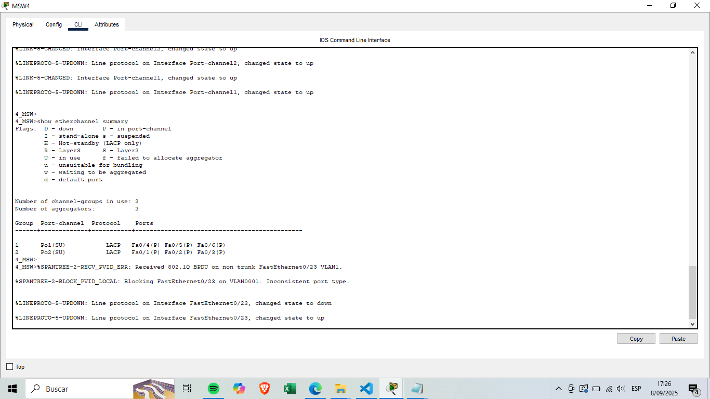

### MSW5

```bash
enable 
config terminal
hostname 5_MSW

vtp version 2
vtp mode client
vtp domain C4_FIUComm

spanning-tree mode rapid-pvst

!G1 VERDE
interface range FastEthernet0/4-6
 switchport trunk encapsulation dot1q
 switchport mode trunk
 channel-group 1 mode desirable
 no shutdown
exit

interface port-channel 1
 switchport trunk encapsulation dot1q
 switchport mode trunk
 switchport trunk allowed vlan 1,11,21,31,41,51
exit

!G2 ROJO
interface range FastEthernet0/16-18
 switchport trunk encapsulation dot1q
 switchport mode trunk
 channel-group 2 mode active
 no shutdown
exit

interface port-channel 2
 switchport trunk encapsulation dot1q
 switchport mode trunk
 switchport trunk allowed vlan 1,11,21,31,41,51
exit

!G3 AZUL
interface range FastEthernet0/1-3
 switchport trunk encapsulation dot1q
 switchport mode trunk
 channel-group 3 mode active
 no shutdown
exit

interface port-channel 3
 switchport trunk encapsulation dot1q
 switchport mode trunk
 switchport trunk allowed vlan 1,11,21,31,41,51
exit


vtp password proyecto12025
exit 
write
enable 
reload
```

#### Tabla de MSW5


| Port    | Device   | Status      | Vlan | Duplex | Speed | Type         |
|---------|----------|-------------|------|--------|-------|--------------|
| Fa0/1   | MSW4     | connected   | trunk| auto   | auto  | 10/100BaseTX |
| Fa0/2   | MSW4    | connected   | trunk| auto   | auto  | 10/100BaseTX |
| Fa0/3   | MSW4     | connected   | trunk| auto   | auto  | 10/100BaseTX |
| Fa0/4   | MSW2     | connected   | trunk| auto   | auto  | 10/100BaseTX |
| Fa0/5   | MSW2     | connected   | trunk| auto   | auto  | 10/100BaseTX |
| Fa0/6   | MSW2     | connected   | trunk| auto   | auto  | 10/100BaseTX |
| Fa0/16  | SERVIDOR | connected   | trunk| auto   | auto  | 10/100BaseTX |
| Fa0/17  | SERVIDOR | connected   | trunk| auto   | auto  | 10/100BaseTX |
| Fa0/18  | SERVIDOR | connected   | trunk| auto   | auto  | 10/100BaseTX |
| Fa0/22  | MSW8     | connected   | trunk| auto   | auto  | 10/100BaseTX |
| ...     | ...      | notconnect  | 1    | auto   | auto  | 10/100BaseTX |


#### TABLA DE GRUPOS
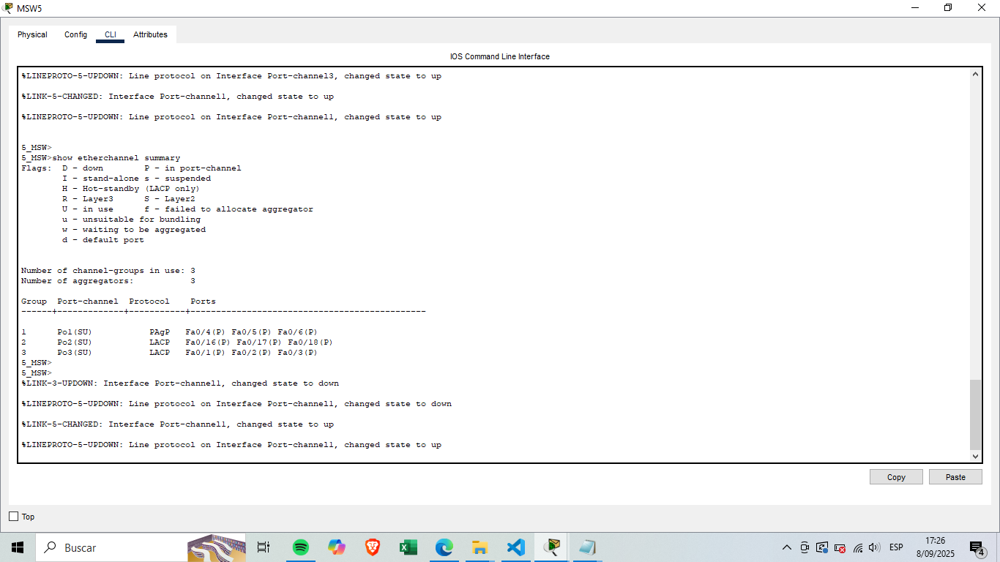


### MSW6
```bash
enable 
config terminal
hostname 6_MSW

vtp version 2
vtp mode client
vtp domain C4_FIUComm

spanning-tree mode rapid-pvst

!G1 VERDE
interface range FastEthernet0/4-6
 switchport trunk encapsulation dot1q
 switchport mode trunk
 channel-group 1 mode desirable
 no shutdown
exit

interface port-channel 1
 switchport trunk encapsulation dot1q
 switchport mode trunk
 switchport trunk allowed vlan 1,11,21,31,41,51
exit

!G2 ROJO
interface range FastEthernet0/12-15
 switchport trunk encapsulation dot1q
 switchport mode trunk
 channel-group 2 mode active
 no shutdown
exit

interface port-channel 2
 switchport trunk encapsulation dot1q
 switchport mode trunk
 switchport trunk allowed vlan 1,11,21,31,41,51
exit

!G3 AZUL
interface range FastEthernet0/1-3
 switchport trunk encapsulation dot1q
 switchport mode trunk
 channel-group 3 mode active
 no shutdown
exit

interface port-channel 3
 switchport trunk encapsulation dot1q
 switchport mode trunk
 switchport trunk allowed vlan 1,11,21,31,41,51
exit


vtp password proyecto12025
exit 
write
enable 
reload

```


#### Tabla de MSW6


| Port    | Device   | Status      | Vlan | Duplex | Speed | Type         |
|---------|----------|-------------|------|--------|-------|--------------|
| Fa0/1   | MSW3     | connected   | trunk| auto   | auto  | 10/100BaseTX |
| Fa0/2   | MSW3     | connected   | trunk| auto   | auto  | 10/100BaseTX |
| Fa0/3   | MSW3     | connected   | trunk| auto   | auto  | 10/100BaseTX |
| Fa0/4   | MSW1     | connected   | trunk| auto   | auto  | 10/100BaseTX |
| Fa0/5   | MSW1     | connected   | trunk| auto   | auto  | 10/100BaseTX |
| Fa0/6   | MSW1     | connected   | trunk| auto   | auto  | 10/100BaseTX |
| Fa0/13  | SERVIDOR | connected   | trunk| auto   | auto  | 10/100BaseTX |
| Fa0/14  | SERVIDOR | connected   | trunk| auto   | auto  | 10/100BaseTX |
| Fa0/15  | SERVIDOR | connected   | trunk| auto   | auto  | 10/100BaseTX |
| Fa0/23  | MSW7     | connected   | trunk| auto   | auto  | 10/100BaseTX |
| ...     | ...      | notconnect  | 1    | auto   | auto  | 10/100BaseTX |


#### TABLA DE GRUPOS
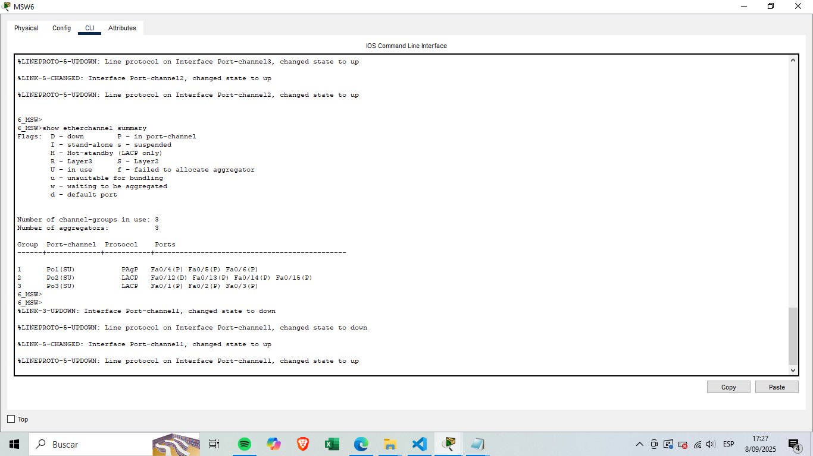


## GENERAL

### MSW10

```bash
enable 
config terminal
hostname 10_MSW

vtp mode client
vtp version 2
vtp domain C4_FIUComm

spanning-tree mode rapid-pvst

interface FastEthernet0/22
 switchport mode trunk
 switchport trunk allowed vlan 1,11,21,31,41,51
 no shutdown

interface FastEthernet0/21
 switchport mode trunk
 switchport trunk allowed vlan 1,11,21,31,41,51
 no shutdown

vtp password proyecto12025
exit 
write
enable 
reload

############ MW1
enable 
config terminal
interface FastEthernet0/21
 switchport mode trunk
 switchport trunk allowed vlan 1,11,21,31,41,51
 no shutdown
exit
exit
write
enable
reload

############ MW2
enable 
config terminal
interface FastEthernet0/22
 switchport mode trunk
 switchport trunk allowed vlan 1,11,21,31,41,51
 no shutdown
exit
exit
write
enable
reload
```


#### Tabla de MSW10
| Port    | Device   | Status      | Vlan | Duplex | Speed | Type         |
|---------|----------|-------------|------|--------|-------|--------------|
| Fa0/3   | SW15     | connected   | trunk| auto   | auto  | 10/100BaseTX |
| Fa0/21   | MSW1     | connected   | trunk| auto   | auto  | 10/100BaseTX |
| Fa0/22   | MSW2     | connected   | trunk| auto   | auto  | 10/100BaseTX |

#### MENSAJE DE BIENVENIDA
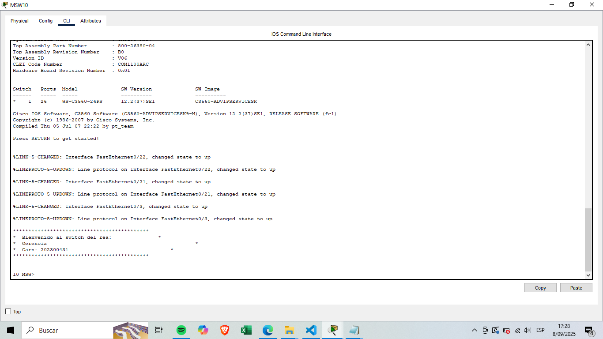


### SW13
```bash
enable 
config terminal
hostname 13_SW

vtp version 2
vtp mode client
vtp domain C4_FIUComm

spanning-tree mode rapid-pvst

interface FastEthernet0/3
 switchport mode trunk
 switchport trunk allowed vlan 1,11,21,31,41,51
 no shutdown
exit

interface FastEthernet0/11
 switchport mode acces
 switchport acces vlan 21
 no shutdown
exit

vtp password proyecto12025
exit 
write
enable 
reload
```
#### tABLA DE SW13
| Port    | Device   | Status      | Vlan | Duplex | Speed | Type         |
|---------|----------|-------------|------|--------|-------|--------------|
| Fa0/1   | SW14     | connected   | trunk| auto   | auto  | 10/100BaseTX |
| Fa0/11   | AD6     | connected   | 21| auto   | auto  | 10/100BaseTX |


### SW14
```bash
enable 
config terminal
hostname 14_SW

vtp version 2
vtp mode client
vtp domain C4_FIUComm

spanning-tree mode rapid-pvst

interface FastEthernet0/1
 switchport mode trunk
 switchport trunk allowed vlan 1,11,21,31,41,51
 no shutdown
exit

interface FastEthernet0/2
 switchport mode trunk
 switchport trunk allowed vlan 1,11,21,31,41,51
 no shutdown
exit

interface FastEthernet0/11
 switchport mode acces
 switchport acces vlan 41
 no shutdown
exit

interface FastEthernet0/12
 switchport mode acces
 switchport acces vlan 31
 no shutdown
exit

vtp password proyecto12025
exit 
write
enable 
reload
```

#### tABLA DE SW14
| Port    | Device   | Status      | Vlan | Duplex | Speed | Type         |
|---------|----------|-------------|------|--------|-------|--------------|
| Fa0/1   | SW13     | connected   | trunk| auto   | auto  | 10/100BaseTX |
| Fa0/2   | SW15     | connected   | trunk| auto   | auto  | 10/100BaseTX |
| Fa0/11   | S1     | connected   | 41| auto   | auto  | 10/100BaseTX |
| Fa0/12   | IT5     | connected   | 31| auto   | auto  | 10/100BaseTX |


### SW15
```bash
enable 
config terminal
hostname 15_SW

vtp version 2
vtp mode client
vtp domain C4_FIUComm

spanning-tree mode rapid-pvst

interface FastEthernet0/3
 switchport mode trunk
 switchport trunk allowed vlan 1,11,21,31,41,51
 no shutdown
exit

interface FastEthernet0/1
 switchport mode trunk
 switchport trunk allowed vlan 1,11,21,31,41,51
 no shutdown
exit

interface FastEthernet0/2
 switchport mode trunk
 switchport trunk allowed vlan 1,11,21,31,41,51
 no shutdown
exit

interface FastEthernet0/11
 switchport mode acces
 switchport acces vlan 11
 no shutdown
exit

vtp password proyecto12025
exit 
write
enable 
reload
```

#### Tabla de SW15
| Port    | Device   | Status      | Vlan | Duplex | Speed | Type         |
|---------|----------|-------------|------|--------|-------|--------------|
| Fa0/1   | SW16     | connected   | trunk| auto   | auto  | 10/100BaseTX |
| Fa0/2   | SW14     | connected   | trunk| auto   | auto  | 10/100BaseTX |
| Fa0/3   | MSW10     | connected   | trunk| auto   | auto  | 10/100BaseTX |
| Fa0/11   | RD8     | connected   | 11| auto   | auto  | 10/100BaseTX |

### SW16

```bash
enable 
config terminal
hostname 16_SW

vtp version 2
vtp mode client
vtp domain C4_FIUComm

spanning-tree mode rapid-pvst

interface FastEthernet0/1
 switchport mode trunk
 switchport trunk allowed vlan 1,11,21,31,41,51
 no shutdown
exit

interface FastEthernet0/2
 switchport mode trunk
 switchport trunk allowed vlan 1,11,21,31,41,51
 no shutdown
exit

interface FastEthernet0/11
 switchport mode acces
 switchport acces vlan 51
 no shutdown
exit

vtp password proyecto12025
exit 
write
enable 
reload
```

#### tABLA DE SW16
| Port    | Device   | Status      | Vlan | Duplex | Speed | Type         |
|---------|----------|-------------|------|--------|-------|--------------|
| Fa0/1   | SW15     | connected   | trunk| auto   | auto  | 10/100BaseTX |
| Fa0/2   | SW17     | connected   | trunk| auto   | auto  | 10/100BaseTX |
| Fa0/11   | G1     | connected   | 51| auto   | auto  | 10/100BaseTX |


### SW17

```bash
enable 
config terminal
hostname 17_SW

vtp version 2
vtp mode client
vtp domain C4_FIUComm

spanning-tree mode rapid-pvst

interface FastEthernet0/2
 switchport mode trunk
 switchport trunk allowed vlan 1,11,21,31,41,51
 no shutdown
exit

interface FastEthernet0/11
 switchport mode acces
 switchport acces vlan 21
 no shutdown
exit

interface FastEthernet0/12
 switchport mode acces
 switchport acces vlan 31
 no shutdown
exit

vtp password proyecto12025
exit 
write
enable 
reload

```

#### tABLA DE SW17
| Port    | Device   | Status      | Vlan | Duplex | Speed | Type         |
|---------|----------|-------------|------|--------|-------|--------------|
| Fa0/2   | SW16     | connected   | trunk| auto   | auto  | 10/100BaseTX |
| Fa0/11   | AD7     | connected   | 21| auto   | auto  | 10/100BaseTX |
| Fa0/12   | IT4     | connected   | 31| auto   | auto  | 10/100BaseTX |


## INFRAESTRUCTURA IT


### MSW8

```bash
enable 
config terminal
hostname 9_MSW

vtp mode client
vtp version 2
vtp domain C4_FIUComm

spanning-tree mode rapid-pvst

interface FastEthernet0/21
 switchport trunk encapsulation dot1q
 switchport mode trunk
 switchport trunk allowed vlan 1,11,21,31,41,51
 no shutdown
exit

interface FastEthernet0/22
 switchport trunk encapsulation dot1q 
switchport mode trunk
 switchport trunk allowed vlan 1,11,21,31,41,51
 no shutdown
exit

interface FastEthernet0/3
 switchport trunk encapsulation dot1q
 switchport mode trunk
 switchport trunk allowed vlan 1,11,21,31,41,51
 no shutdown
exit


vtp password proyecto12025
exit 
write
enable 
reload

############ MW2
enable 
config terminal
interface FastEthernet0/22
 switchport trunk encapsulation dot1q
 switchport mode trunk
 switchport trunk allowed vlan 1,11,21,31,41,51
 no shutdown
exit
exit
write
enable
reload

############ MW5
enable 
config terminal
interface FastEthernet0/22
 switchport mode trunk
 switchport trunk allowed vlan 1,11,21,31,41,51
 no shutdown
exit
exit
write
enable
reload

############ MW4
enable 
config terminal
interface FastEthernet0/23
 switchport mode trunk
 switchport trunk allowed vlan 1,11,21,31,41,51
 no shutdown
exit
exit
write
enable
reload
```

#### tABLA DE MSW8
| Port    | Device   | Status      | Vlan | Duplex | Speed | Type         |
|---------|----------|-------------|------|--------|-------|--------------|
| Fa0/1   | SW8     | connected   | trunk| auto   | auto  | 10/100BaseTX |
| Fa0/2   | SW12     | connected   | trunk| auto   | auto  | 10/100BaseTX |
| Fa0/3   | Swicht19     | connected   | trunk| auto   | auto  | 10/100BaseTX |
| Fa0/21   | MSW2     | connected   | trunk| auto   | auto  | 10/100BaseTX |
| Fa0/22   | MSW5     | connected   | trunk| auto   | auto  | 10/100BaseTX |
| Fa0/23   | MSW4     | connected   | trunk| auto   | auto  | 10/100BaseTX |


#### tabla de bienvenida
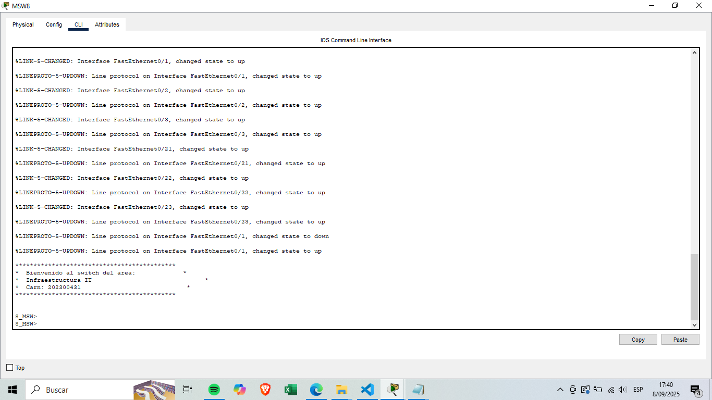


### SW8

```bash
enable 
config terminal
hostname 8_SW

vtp version 2
vtp mode client
vtp domain C4_FIUComm

spanning-tree mode rapid-pvst

interface FastEthernet0/1
 switchport mode trunk
 switchport trunk allowed vlan 1,11,21,31,41,51
 no shutdown
exit

interface FastEthernet0/2
 switchport mode trunk
 switchport trunk allowed vlan 1,11,21,31,41,51
 no shutdown
exit

interface FastEthernet0/11
 switchport mode acces
 switchport acces vlan 11
 no shutdown
exit

interface FastEthernet0/12
 switchport mode acces
 switchport acces vlan 31
 no shutdown
exit

vtp password proyecto12025
exit 
write
enable 
reload

```

#### tABLA DE SW8
| Port    | Device   | Status      | Vlan | Duplex | Speed | Type         |
|---------|----------|-------------|------|--------|-------|--------------|
| Fa0/1   | MSW8     | connected   | trunk| auto   | auto  | 10/100BaseTX |
| Fa0/2   | SW9     | connected   | trunk| auto   | auto  | 10/100BaseTX |
| Fa0/11   | RD7     | connected   | 11| auto   | auto  | 10/100BaseTX |
| Fa0/12   | IT1     | connected   | 31| auto   | auto  | 10/100BaseTX |


### SW9

```bash
enable 
config terminal
hostname 9_SW

vtp version 2
vtp mode client
vtp domain C4_FIUComm

spanning-tree mode rapid-pvst

interface FastEthernet0/1
 switchport mode trunk
 switchport trunk allowed vlan 1,11,21,31,41,51
 no shutdown
exit

interface FastEthernet0/2
 switchport mode trunk
 switchport trunk allowed vlan 1,11,21,31,41,51
 no shutdown
exit

interface FastEthernet0/11
 switchport mode acces
 switchport acces vlan 21
 no shutdown
exit


vtp password proyecto12025
exit 
write
enable 
reload

```

#### tABLA DE SW9
| Port    | Device   | Status      | Vlan | Duplex | Speed | Type         |
|---------|----------|-------------|------|--------|-------|--------------|
| Fa0/1   | SW10     | connected   | trunk| auto   | auto  | 10/100BaseTX |
| Fa0/2   | SW8     | connected   | trunk| auto   | auto  | 10/100BaseTX |
| Fa0/11   | AD8     | connected   | 21| auto   | auto  | 10/100BaseTX |


### SW10

```bash
enable 
config terminal
hostname 10_SW

vtp version 2
vtp mode client
vtp domain C4_FIUComm

spanning-tree mode rapid-pvst

interface FastEthernet0/1
 switchport mode trunk
 switchport trunk allowed vlan 1,11,21,31,41,51
 no shutdown
exit

interface FastEthernet0/2
 switchport mode trunk
 switchport trunk allowed vlan 1,11,21,31,41,51
 no shutdown
exit

interface FastEthernet0/11
 switchport mode acces
 switchport acces vlan 11
 no shutdown
exit

interface FastEthernet0/12
 switchport mode acces
 switchport acces vlan 51
 no shutdown
exit

vtp password proyecto12025
exit 
write
enable 
reload
```


#### tABLA DE SW10
| Port    | Device   | Status      | Vlan | Duplex | Speed | Type         |
|---------|----------|-------------|------|--------|-------|--------------|
| Fa0/1   | SW9     | connected   | trunk| auto   | auto  | 10/100BaseTX |
| Fa0/2   | SW11     | connected   | trunk| auto   | auto  | 10/100BaseTX |
| Fa0/11   | RD6     | connected   | 11| auto   | auto  | 10/100BaseTX |
| Fa0/12   | G5     | connected   | 51| auto   | auto  | 10/100BaseTX |


### SW11

```bash
enable 
config terminal
hostname 11_SW

vtp version 2
vtp mode client
vtp domain C4_FIUComm

spanning-tree mode rapid-pvst

interface FastEthernet0/1
 switchport mode trunk
 switchport trunk allowed vlan 1,11,21,31,41,51
 no shutdown
exit

interface FastEthernet0/2
 switchport mode trunk
 switchport trunk allowed vlan 1,11,21,31,41,51
 no shutdown
exit

interface FastEthernet0/11
 switchport mode acces
 switchport acces vlan 31
 no shutdown
exit

interface FastEthernet0/12
 switchport mode acces
 switchport acces vlan 51
 no shutdown
exit

vtp password proyecto12025
exit 
write
enable 
reload
```

#### tABLA DE SW11
| Port    | Device   | Status      | Vlan | Duplex | Speed | Type         |
|---------|----------|-------------|------|--------|-------|--------------|
| Fa0/1   | SW12     | connected   | trunk| auto   | auto  | 10/100BaseTX |
| Fa0/2   | SW10     | connected   | trunk| auto   | auto  | 10/100BaseTX |
| Fa0/11   | IT2     | connected   | 31| auto   | auto  | 10/100BaseTX |
| Fa0/12   | G5     | connected   | 51| auto   | auto  | 10/100BaseTX |

### SW12

```bash
enable 
config terminal
hostname 12_SW

vtp version 2
vtp mode client
vtp domain C4_FIUComm

spanning-tree mode rapid-pvst

interface FastEthernet0/1
 switchport mode trunk
 switchport trunk allowed vlan 1,11,21,31,41,51
 no shutdown
exit

interface FastEthernet0/2
 switchport mode trunk
 switchport trunk allowed vlan 1,11,21,31,41,51
 no shutdown
exit

interface FastEthernet0/11
 switchport mode acces
 switchport acces vlan 41
 no shutdown
exit

interface FastEthernet0/12
 switchport mode acces
 switchport acces vlan 31
 no shutdown
exit

vtp password proyecto12025
exit 
write
enable 
reload
```


#### tABLA DE SW12
| Port    | Device   | Status      | Vlan | Duplex | Speed | Type         |
|---------|----------|-------------|------|--------|-------|--------------|
| Fa0/1   | SW11     | connected   | trunk| auto   | auto  | 10/100BaseTX |
| Fa0/2   | MSW8     | connected   | trunk| auto   | auto  | 10/100BaseTX |
| Fa0/11   | S5     | connected   | 41| auto   | auto  | 10/100BaseTX |
| Fa0/12   | IT3     | connected   | 31| auto   | auto  | 10/100BaseTX |


### SWicht19
```bash
enable 
config terminal
hostname 19_swictg

vtp version 2
vtp mode transparent
vtp domain C4_FIUComm

spanning-tree mode rapid-pvst

interface FastEthernet0/3
 switchport mode trunk
 switchport trunk allowed vlan 1,11,21,31,41,51
 no shutdown
exit

vlan 71
 name Local
exit


interface FastEthernet0/11
 switchport mode acces
 switchport acces vlan 71
 no shutdown
exit

interface FastEthernet0/12
 switchport mode acces
 switchport acces vlan 71
 no shutdown
exit

interface FastEthernet0/13
 switchport mode acces
 switchport acces vlan 71
 no shutdown
exit

vtp password proyecto12025
exit 
write
enable 
reload

```


#### tABLA DE SWICHT19
| Port    | Device   | Status      | Vlan | Duplex | Speed | Type         |
|---------|----------|-------------|------|--------|-------|--------------|
| Fa0/3   | MSW8     | connected   | trunk| auto   | auto  | 10/100BaseTX |
| Fa0/11   | local1     | connected   | trunk| auto   | auto  | 10/100BaseTX |
| Fa0/12   | local2     | connected   | trunk| auto   | auto  | 10/100BaseTX |
| Fa0/13   | local3     | connected   | trunk| auto   | auto  | 10/100BaseTX |


## REDACCION DIGITAL


### MSW9

```bash
enable 
config terminal
hostname 9_MSW

vtp mode client
vtp version 2
vtp domain C4_FIUComm

spanning-tree mode rapid-pvst

interface FastEthernet0/21
 switchport trunk encapsulation dot1q
 switchport mode trunk
 switchport trunk allowed vlan 1,11,21,31,41,51
 no shutdown
exit

interface FastEthernet0/22
 switchport trunk encapsulation dot1q 
switchport mode trunk
 switchport trunk allowed vlan 1,11,21,31,41,51
 no shutdown
exit

interface FastEthernet0/2
 switchport trunk encapsulation dot1q
 switchport mode trunk
 switchport trunk allowed vlan 1,11,21,31,41,51
 no shutdown
exit

interface FastEthernet0/3
 switchport trunk encapsulation dot1q
 switchport mode trunk
 switchport trunk allowed vlan 1,11,21,31,41,51
 no shutdown
exit

interface FastEthernet0/1
 switchport trunk encapsulation dot1q
 switchport mode trunk
 switchport trunk allowed vlan 1,11,21,31,41,51
 no shutdown
exit

interface FastEthernet0/11
 switchport mode acces
 switchport acces vlan 41
 no shutdown
exit

vtp password proyecto12025
exit 
write
enable 
reload

############ MW3
enable 
config terminal
interface FastEthernet0/22
 switchport trunk encapsulation dot1q
 switchport mode trunk
 switchport trunk allowed vlan 1,11,21,31,41,51
 no shutdown
exit
exit
write
enable
reload

############ MW4
enable 
config terminal
interface FastEthernet0/22
 switchport mode trunk
 switchport trunk allowed vlan 1,11,21,31,41,51
 no shutdown
exit
exit
write
enable
reload

```


#### tABLA DE MSW9
| Port    | Device   | Status      | Vlan | Duplex | Speed | Type         |
|---------|----------|-------------|------|--------|-------|--------------|
| Fa0/1   | sw18| connected   | trunk| auto   | auto  | 10/100BaseTX |
| Fa0/2   | sw19 |  connected   | trunk| auto   | auto  | 10/100BaseTX |
| Fa0/11   | S3     | connected   | 41 | auto   | auto  | 10/100BaseTX |
| Fa0/21   | MSW2     | connected   | trunk| auto   | auto  | 10/100BaseTX |
| Fa0/22   | MSW4     | connected   | trunk| auto   | auto  | 10/100BaseTX |

#### MENSAJE DE BIENVENIDA
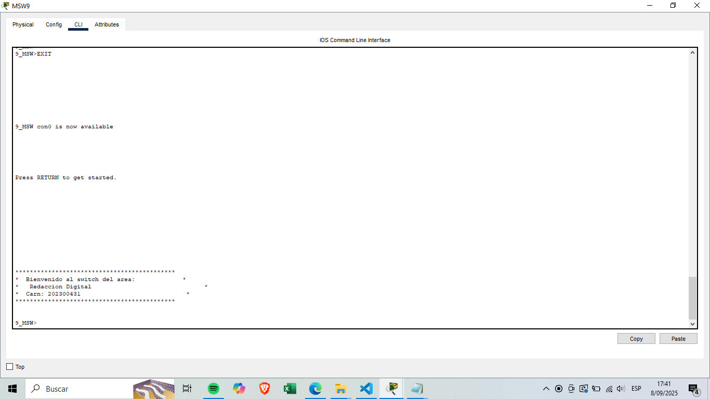


### SW18

```bash
enable 
config terminal
hostname 18_SW

vtp version 2
vtp mode client
vtp domain C4_FIUComm

spanning-tree mode rapid-pvst

interface FastEthernet0/1
 switchport mode trunk
 switchport trunk allowed vlan 1,11,21,31,41,51
 no shutdown
exit

interface FastEthernet0/2
 switchport mode trunk
 switchport trunk allowed vlan 1,11,21,31,41,51
 no shutdown
exit

vtp password proyecto12025
exit 
write
enable 
reload


```


#### tABLA DE SW18
| Port    | Device   | Status      | Vlan | Duplex | Speed | Type         |
|---------|----------|-------------|------|--------|-------|--------------|
| Fa0/1   | MSW9 | connected   | trunk| auto   | auto  | 10/100BaseTX |
| Fa0/2   | sw20 |  connected   | trunk| auto   | auto  | 10/100BaseTX |

### SW19

```bash
enable 
config terminal
hostname 19_SW

vtp version 2
vtp mode client
vtp domain C4_FIUComm

spanning-tree mode rapid-pvst

interface FastEthernet0/2
 switchport mode trunk
 switchport trunk allowed vlan 1,11,21,31,41,51
 no shutdown
exit

interface FastEthernet0/11
 switchport mode acces
 switchport acces vlan 51
 no shutdown
exit

vtp password proyecto12025
exit 
write
enable 
reload


```


#### tABLA DE SW19
| Port    | Device   | Status      | Vlan | Duplex | Speed | Type         |
|---------|----------|-------------|------|--------|-------|--------------|
| Fa0/2   | MSW9 |  connected   | trunk| auto   | auto  | 10/100BaseTX |
| Fa0/11   | G2     | connected   | 51 | auto   | auto  | 10/100BaseTX |

### SW20

```bash
enable 
config terminal
hostname 12_SW

vtp version 2
vtp mode client
vtp domain C4_FIUComm

spanning-tree mode rapid-pvst

interface FastEthernet0/2
 switchport mode trunk
 switchport trunk allowed vlan 1,11,21,31,41,51
 no shutdown
exit

interface FastEthernet0/11
 switchport mode acces
 switchport acces vlan 41
 no shutdown
exit

interface FastEthernet0/12
 switchport mode acces
 switchport acces vlan 11
 no shutdown
exit

vtp password proyecto12025
exit 
write
enable 
reload

```


#### tABLA DE SW20
| Port    | Device   | Status      | Vlan | Duplex | Speed | Type         |
|---------|----------|-------------|------|--------|-------|--------------|
| Fa0/2   | SW18 |  connected   | trunk| auto   | auto  | 10/100BaseTX |
| Fa0/11   | S2     | connected   | 41 | auto   | auto  | 10/100BaseTX |
| Fa0/12   | RD2     | connected   | 11 | auto   | auto  | 10/100BaseTX |


## Analisis de datos

### MSW7

```bash
enable 
config terminal
hostname 7_MSW

vtp mode client
vtp version 2
vtp domain C4_FIUComm

spanning-tree mode rapid-pvst

interface FastEthernet0/22
 switchport trunk encapsulation dot1q
 switchport mode trunk
 switchport trunk allowed vlan 1,11,21,31,41,51
 no shutdown
exit

interface FastEthernet0/23
 switchport trunk encapsulation dot1q 
switchport mode trunk
 switchport trunk allowed vlan 1,11,21,31,41,51
 no shutdown
exit

interface FastEthernet0/24
 switchport trunk encapsulation dot1q 
switchport mode trunk
 switchport trunk allowed vlan 1,11,21,31,41,51
 no shutdown
exit

interface FastEthernet0/1
 switchport trunk encapsulation dot1q
 switchport mode trunk
 switchport trunk allowed vlan 1,11,21,31,41,51
 no shutdown
exit

interface FastEthernet0/2
 switchport trunk encapsulation dot1q
 switchport mode trunk
 switchport trunk allowed vlan 1,11,21,31,41,51
 no shutdown
exit

interface FastEthernet0/3
 switchport trunk encapsulation dot1q
 switchport mode trunk
 switchport trunk allowed vlan 1,11,21,31,41,51
 no shutdown
exit

interface FastEthernet0/4
 switchport trunk encapsulation dot1q
 switchport mode trunk
 switchport trunk allowed vlan 1,11,21,31,41,51
 no shutdown
exit

interface FastEthernet0/5
 switchport trunk encapsulation dot1q
 switchport mode trunk
 switchport trunk allowed vlan 1,11,21,31,41,51
 no shutdown
exit

vtp password proyecto12025
exit 
write
enable 
reload

############ MW1
enable 
config terminal
interface FastEthernet0/22
 switchport trunk encapsulation dot1q
 switchport mode trunk
 switchport trunk allowed vlan 1,11,21,31,41,51
 no shutdown
exit
exit
write
enable
reload

############ MW6
enable 
config terminal
interface FastEthernet0/23
 switchport mode trunk
 switchport trunk allowed vlan 1,11,21,31,41,51
 no shutdown
exit
exit
write
enable
reload

############ MW3
enable 
config terminal
interface FastEthernet0/24
 switchport mode trunk
 switchport trunk allowed vlan 1,11,21,31,41,51
 no shutdown
exit
exit
write
enable
reload
```

#### tABLA DE MSW7
| Port    | Device   | Status      | Vlan | Duplex | Speed | Type         |
|---------|----------|-------------|------|--------|-------|--------------|
| Fa0/1   | sw1 | connected   | trunk| auto   | auto  | 10/100BaseTX |
| Fa0/2   | sw7 |  connected   | trunk| auto   | auto  | 10/100BaseTX |
| Fa0/3   | sw4 | connected   | trunk | auto   | auto  | 10/100BaseTX |
| Fa0/4   | SW5     | connected   | trunk| auto   | auto  | 10/100BaseTX |
| Fa0/5   | sw3     | connected   | trunk| auto   | auto  | 10/100BaseTX |
| Fa0/22   | MSW1     | connected   | trunk| auto   | auto  | 10/100BaseTX |
| Fa0/23   | MSW6     | connected   | trunk| auto   | auto  | 10/100BaseTX |
| Fa0/24   | MSW3     | connected   | trunk| auto   | auto  | 10/100BaseTX |


#### MENSAJE DE BIENVEIDA

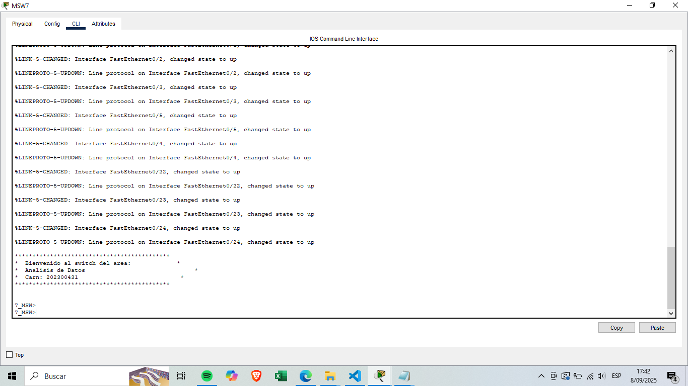

### SW1

```bash
enable 
config terminal
hostname 1_SW

vtp version 2
vtp mode client
vtp domain C4_FIUComm

spanning-tree mode rapid-pvst

interface FastEthernet0/1
 switchport mode trunk
 switchport trunk allowed vlan 1,11,21,31,41,51
 no shutdown
exit

interface FastEthernet0/2
 switchport mode trunk
 switchport trunk allowed vlan 1,11,21,31,41,51
 no shutdown
exit

interface FastEthernet0/3
 switchport mode trunk
 switchport trunk allowed vlan 1,11,21,31,41,51
 no shutdown
exit

interface FastEthernet0/4
 switchport mode trunk
 switchport trunk allowed vlan 1,11,21,31,41,51
 no shutdown
exit

interface FastEthernet0/5
 switchport mode trunk
 switchport trunk allowed vlan 1,11,21,31,41,51
 no shutdown
exit

interface FastEthernet0/11
 switchport mode acces
 switchport acces vlan 21
 no shutdown
exit

interface FastEthernet0/12
 switchport mode acces
 switchport acces vlan 31
 no shutdown
exit

vtp password proyecto12025
exit 
write
enable 
reload


```

#### tABLA DE sw1
| Port    | Device   | Status      | Vlan | Duplex | Speed | Type         |
|---------|----------|-------------|------|--------|-------|--------------|
| Fa0/1   | MSW7 | connected   | trunk| auto   | auto  | 10/100BaseTX |
| Fa0/2   | sw2 |  connected   | trunk| auto   | auto  | 10/100BaseTX |
| Fa0/3   | sw5 | connected   | trunk | auto   | auto  | 10/100BaseTX |
| Fa0/4   | SW4     | connected   | trunk| auto   | auto  | 10/100BaseTX |
| Fa0/5   | sw6     | connected   | trunk| auto   | auto  | 10/100BaseTX |
| Fa0/11   | AD2     | connected   | 21| auto   | auto  | 10/100BaseTX |
| Fa0/12   | IT8     | connected   | 31| auto   | auto  | 10/100BaseTX |


### SW2

```bash

enable 
config terminal
hostname 2_SW

vtp version 2
vtp mode client
vtp domain C4_FIUComm

spanning-tree mode rapid-pvst

interface FastEthernet0/1
 switchport mode trunk
 switchport trunk allowed vlan 1,11,21,31,41,51
 no shutdown
exit

interface FastEthernet0/2
 switchport mode trunk
 switchport trunk allowed vlan 1,11,21,31,41,51
 no shutdown
exit

interface FastEthernet0/3
 switchport mode trunk
 switchport trunk allowed vlan 1,11,21,31,41,51
 no shutdown
exit

interface FastEthernet0/4
 switchport mode trunk
 switchport trunk allowed vlan 1,11,21,31,41,51
 no shutdown
exit

interface FastEthernet0/5
 switchport mode trunk
 switchport trunk allowed vlan 1,11,21,31,41,51
 no shutdown
exit

interface FastEthernet0/11
 switchport mode acces
 switchport acces vlan 11
 no shutdown
exit

vtp password proyecto12025
exit 
write
enable 
reload
```

#### tABLA DE sw2
| Port    | Device   | Status      | Vlan | Duplex | Speed | Type         |
|---------|----------|-------------|------|--------|-------|--------------|
| Fa0/1   | sw3 | connected   | trunk| auto   | auto  | 10/100BaseTX |
| Fa0/2   | sw1 |  connected   | trunk| auto   | auto  | 10/100BaseTX |
| Fa0/3   | sw6 | connected   | trunk | auto   | auto  | 10/100BaseTX |
| Fa0/4   | SW7     | connected   | trunk| auto   | auto  | 10/100BaseTX |
| Fa0/5   | sw5     | connected   | trunk| auto   | auto  | 10/100BaseTX |
| Fa0/11   | RD3     | connected   | 11| auto   | auto  | 10/100BaseTX |


### SW3

```bash
enable 
config terminal
hostname 1_SW

vtp version 2
vtp mode client
vtp domain C4_FIUComm

spanning-tree mode rapid-pvst

interface FastEthernet0/1
 switchport mode trunk
 switchport trunk allowed vlan 1,11,21,31,41,51
 no shutdown
exit

interface FastEthernet0/2
 switchport mode trunk
 switchport trunk allowed vlan 1,11,21,31,41,51
 no shutdown
exit

interface FastEthernet0/3
 switchport mode trunk
 switchport trunk allowed vlan 1,11,21,31,41,51
 no shutdown
exit

interface FastEthernet0/4
 switchport mode trunk
 switchport trunk allowed vlan 1,11,21,31,41,51
 no shutdown
exit

interface FastEthernet0/5
 switchport mode trunk
 switchport trunk allowed vlan 1,11,21,31,41,51
 no shutdown
exit

interface FastEthernet0/11
 switchport mode acces
 switchport acces vlan 21
 no shutdown
exit

interface FastEthernet0/12
 switchport mode acces
 switchport acces vlan 51
 no shutdown
exit

interface FastEthernet0/13
 switchport mode acces
 switchport acces vlan 21
 no shutdown
exit

vtp password proyecto12025
exit 
write
enable 
reload
```

#### tABLA DE sw3
| Port    | Device   | Status      | Vlan | Duplex | Speed | Type         |
|---------|----------|-------------|------|--------|-------|--------------|
| Fa0/1   | sw2 | connected   | trunk| auto   | auto  | 10/100BaseTX |
| Fa0/2   | SW4 |  connected   | trunk| auto   | auto  | 10/100BaseTX |
| Fa0/3   | SW7 | connected   | trunk | auto   | auto  | 10/100BaseTX |
| Fa0/4   | SW6     | connected   | trunk| auto   | auto  | 10/100BaseTX |
| Fa0/5   | MSW7     | connected   | trunk| auto   | auto  | 10/100BaseTX |
| Fa0/11   | AD5     | connected   | 21| auto   | auto  | 10/100BaseTX |
| Fa0/12   | G3     | connected   | 51| auto   | auto  | 10/100BaseTX |
| Fa0/13   | AD1     | connected   | 21| auto   | auto  | 10/100BaseTX |


### SW4

```bash
enable 
config terminal
hostname 4_SW

vtp version 2
vtp mode client
vtp domain C4_FIUComm

spanning-tree mode rapid-pvst

interface FastEthernet0/1
 switchport mode trunk
 switchport trunk allowed vlan 1,11,21,31,41,51
 no shutdown
exit

interface FastEthernet0/2
 switchport mode trunk
 switchport trunk allowed vlan 1,11,21,31,41,51
 no shutdown
exit

interface FastEthernet0/3
 switchport mode trunk
 switchport trunk allowed vlan 1,11,21,31,41,51
 no shutdown
exit

interface FastEthernet0/4
 switchport mode trunk
 switchport trunk allowed vlan 1,11,21,31,41,51
 no shutdown
exit

interface FastEthernet0/5
 switchport mode trunk
 switchport trunk allowed vlan 1,11,21,31,41,51
 no shutdown
exit

interface FastEthernet0/11
 switchport mode acces
 switchport acces vlan 11
 no shutdown
exit

vtp password proyecto12025
exit 
write
enable 
reload
```


#### tABLA DE sw4
| Port    | Device   | Status      | Vlan | Duplex | Speed | Type         |
|---------|----------|-------------|------|--------|-------|--------------|
| Fa0/1   | sw5 | connected   | trunk| auto   | auto  | 10/100BaseTX |
| Fa0/2   | SW3 |  connected   | trunk| auto   | auto  | 10/100BaseTX |
| Fa0/3   | MSW7 | connected   | trunk | auto   | auto  | 10/100BaseTX |
| Fa0/4   | SW1     | connected   | trunk| auto   | auto  | 10/100BaseTX |
| Fa0/5   | SW7     | connected   | trunk| auto   | auto  | 10/100BaseTX |
| Fa0/11   | RD5     | connected   | 11| auto   | auto  | 10/100BaseTX |

### SW5

```bash
enable 
config terminal
hostname 5_SW

vtp version 2
vtp mode client
vtp domain C4_FIUComm

spanning-tree mode rapid-pvst

interface FastEthernet0/1
 switchport mode trunk
 switchport trunk allowed vlan 1,11,21,31,41,51
 no shutdown
exit

interface FastEthernet0/2
 switchport mode trunk
 switchport trunk allowed vlan 1,11,21,31,41,51
 no shutdown
exit

interface FastEthernet0/3
 switchport mode trunk
 switchport trunk allowed vlan 1,11,21,31,41,51
 no shutdown
exit

interface FastEthernet0/4
 switchport mode trunk
 switchport trunk allowed vlan 1,11,21,31,41,51
 no shutdown
exit

interface FastEthernet0/5
 switchport mode trunk
 switchport trunk allowed vlan 1,11,21,31,41,51
 no shutdown
exit

interface FastEthernet0/11
 switchport mode acces
 switchport acces vlan 21
 no shutdown
exit

interface FastEthernet0/12
 switchport mode acces
 switchport acces vlan 51
 no shutdown
exit

interface FastEthernet0/13
 switchport mode acces
 switchport acces vlan 41
 no shutdown
exit

vtp password proyecto12025
exit 
write
enable 
reload
```


#### tABLA DE sw5
| Port    | Device   | Status      | Vlan | Duplex | Speed | Type         |
|---------|----------|-------------|------|--------|-------|--------------|
| Fa0/1   | sw4 | connected   | trunk| auto   | auto  | 10/100BaseTX |
| Fa0/2   | SW6 |  connected   | trunk| auto   | auto  | 10/100BaseTX |
| Fa0/3   | SW1 | connected   | trunk | auto   | auto  | 10/100BaseTX |
| Fa0/4   | MSW7     | connected   | trunk| auto   | auto  | 10/100BaseTX |
| Fa0/5   | sw2     | connected   | trunk| auto   | auto  | 10/100BaseTX |
| Fa0/11   | G4     | connected   | 51| auto   | auto  | 10/100BaseTX |
| Fa0/12   | S4     | connected   | 41| auto   | auto  | 10/100BaseTX |


### SW6

```bash
enable 
config terminal
hostname 6_SW

vtp version 2
vtp mode client
vtp domain C4_FIUComm

spanning-tree mode rapid-pvst

interface FastEthernet0/1
 switchport mode trunk
 switchport trunk allowed vlan 1,11,21,31,41,51
 no shutdown
exit

interface FastEthernet0/2
 switchport mode trunk
 switchport trunk allowed vlan 1,11,21,31,41,51
 no shutdown
exit

interface FastEthernet0/3
 switchport mode trunk
 switchport trunk allowed vlan 1,11,21,31,41,51
 no shutdown
exit

interface FastEthernet0/4
 switchport mode trunk
 switchport trunk allowed vlan 1,11,21,31,41,51
 no shutdown
exit

interface FastEthernet0/5
 switchport mode trunk
 switchport trunk allowed vlan 1,11,21,31,41,51
 no shutdown
exit

interface FastEthernet0/11
 switchport mode acces
 switchport acces vlan 21
 no shutdown
exit

interface FastEthernet0/12
 switchport mode acces
 switchport acces vlan 11
 no shutdown
exit

interface FastEthernet0/13
 switchport mode acces
 switchport acces vlan 21
 no shutdown
exit

vtp password proyecto12025
exit 
write
enable 
reload
```


#### tABLA DE sw6
| Port    | Device   | Status      | Vlan | Duplex | Speed | Type         |
|---------|----------|-------------|------|--------|-------|--------------|
| Fa0/1   | sw7 | connected   | trunk| auto   | auto  | 10/100BaseTX |
| Fa0/2   | SW5 |  connected   | trunk| auto   | auto  | 10/100BaseTX |
| Fa0/3   | sw2 | connected   | trunk | auto   | auto  | 10/100BaseTX |
| Fa0/4   | sw3     | connected   | trunk| auto   | auto  | 10/100BaseTX |
| Fa0/5   | sw1     | connected   | trunk| auto   | auto  | 10/100BaseTX |
| Fa0/11   | AD3     | connected   | 21| auto   | auto  | 10/100BaseTX |
| Fa0/12   | RD4    | connected   | 11| auto   | auto  | 10/100BaseTX |
| Fa0/13   | AD4     | connected   | 21| auto   | auto  | 10/100BaseTX |


### SW7

```bash
enable 
config terminal
hostname 7_SW

vtp version 2
vtp mode client
vtp domain C4_FIUComm

spanning-tree mode rapid-pvst

interface FastEthernet0/1
 switchport mode trunk
 switchport trunk allowed vlan 1,11,21,31,41,51
 no shutdown
exit

interface FastEthernet0/2
 switchport mode trunk
 switchport trunk allowed vlan 1,11,21,31,41,51
 no shutdown
exit

interface FastEthernet0/3
 switchport mode trunk
 switchport trunk allowed vlan 1,11,21,31,41,51
 no shutdown
exit

interface FastEthernet0/4
 switchport mode trunk
 switchport trunk allowed vlan 1,11,21,31,41,51
 no shutdown
exit

interface FastEthernet0/5
 switchport mode trunk
 switchport trunk allowed vlan 1,11,21,31,41,51
 no shutdown
exit

interface FastEthernet0/11
 switchport mode acces
 switchport acces vlan 11
 no shutdown
exit

interface FastEthernet0/12
 switchport mode acces
 switchport acces vlan 31
 no shutdown
exit

vtp password proyecto12025
exit 
write
enable 
reload
```

#### tABLA DE sw7
| Port    | Device   | Status      | Vlan | Duplex | Speed | Type         |
|---------|----------|-------------|------|--------|-------|--------------|
| Fa0/1   | SW6 | connected   | trunk| auto   | auto  | 10/100BaseTX |
| Fa0/2   | MSW7 |  connected   | trunk| auto   | auto  | 10/100BaseTX |
| Fa0/3   | SW3 | connected   | trunk | auto   | auto  | 10/100BaseTX |
| Fa0/4   | SW2     | connected   | trunk| auto   | auto  | 10/100BaseTX |
| Fa0/5   | sw4     | connected   | trunk| auto   | auto  | 10/100BaseTX |
| Fa0/11   | RD1     | connected   | 11| auto   | auto  | 10/100BaseTX |
| Fa0/12   | IT7     | connected   | 31| auto   | auto  | 10/100BaseTX |


## PRUEBAS DE PINGS:
### RD -> 11 
RD1 - RD8
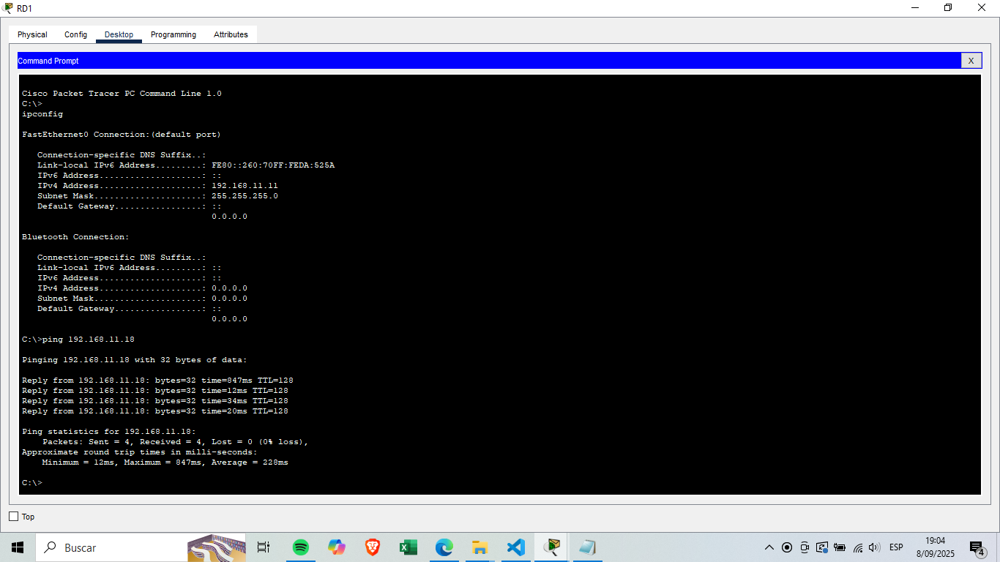
RD8 - RD1

### AD -> 21 
AD1 - AD8

AD8 - AD1

### IT -> 31 
IT1 - IT5

IT5 - IT1
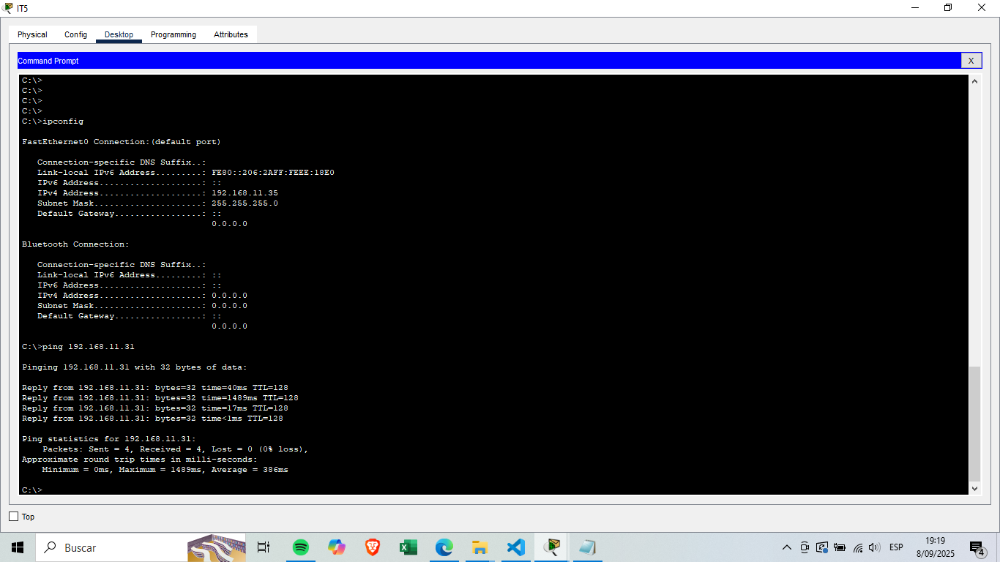
### S -> 41 
S1 - S5
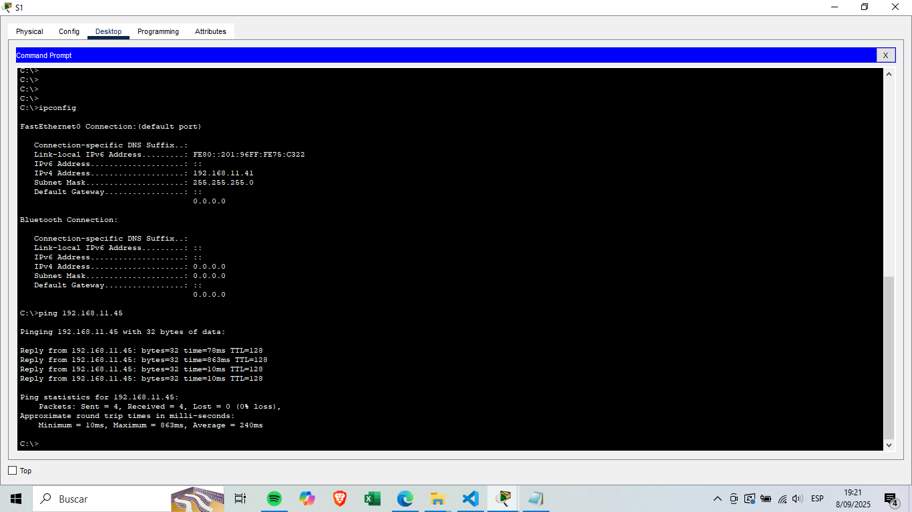
S5 -S1

### G -> 51
G1 - G5

G5 -G1
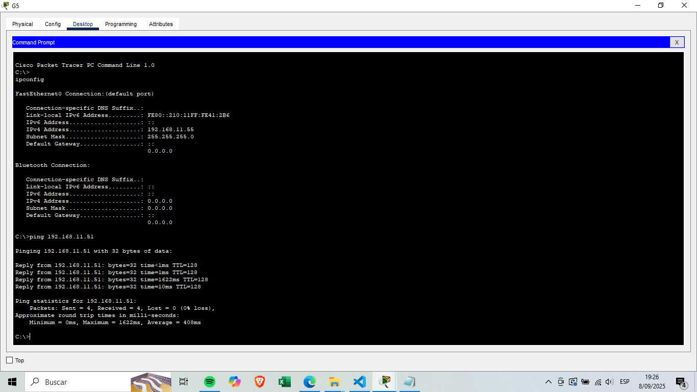


## Presupuesto:

### Resumen de Dispositivos y Materiales

- **Laptops:** 17 unidades
- **Computadoras de escritorio:** 19 unidades
- **Switches Cisco Catalyst 3560-24PS PoE:** 11 unidades
- **Switches Cisco 2960-24TT:** 21 unidades
- **Cables UTP Cat6:** 36 tramos (2m c/u)
- **Cables coaxiales:** 30 tramos (5m c/u)
- **Patch panel, canaletas, racks:** 5
- **Conectores y accesorios varios**

### Estimación de Costos (precios referenciales en quetzales, Q7.8 = 1 USD)

| Dispositivo/Material                 | Cantidad | Precio unitario (Q) | Subtotal (Q) |
|--------------------------------------|----------|---------------------|--------------|
| Laptop                              | 17       | Q4,680              | Q79,560      |
| Computadora de escritorio           | 19       | Q3,900              | Q74,100      |
| Switch Catalyst 3560-24PS PoE       | 11       | Q9,360              | Q102,960     |
| Switch 2960-24TT                    | 21       | Q6,240              | Q131,040     |
| Cable UTP Cat6 (2m c/u)             | 36       | Q23                 | Q828         |
| Cable coaxial (5m c/u)              | 30       | Q55                 | Q1,650       |
| Patch panel, canaletas, racks       | 5        | Q1,170              | Q5,850       |
| Conectores, accesorios              | -        | -                   | Q2,340       |
| **Subtotal equipos y materiales**   |          |                     | **Q398,328** |

### Mano de Obra

- **Instalación de cableado:** Q62 por punto (66 puntos) = Q4,092
- **Configuración de switches y pruebas:** Q156 por switch (32) = Q4,992
- **Montaje de racks, canaletas, organización:** Q2,340
- **Total mano de obra:** **Q11,424**

### Tiempo estimado de trabajo

- Instalación física de cableado: 2 días (2 técnicos)
- Montaje y organización de racks: 1 día (2 técnicos)
- Configuración y pruebas de switches: 1 día (1 técnico especializado)
- **Total estimado:** 3-4 días de trabajo

### Presupuesto total estimado

| Concepto                | Monto (Q)   |
|-------------------------|-------------|
| Equipos y materiales    | Q398,328    |
| Mano de obra            | Q11,424     |
| **Total**               | **Q409,752**|

- **Presupuesto final:** **Q409,752**

---
